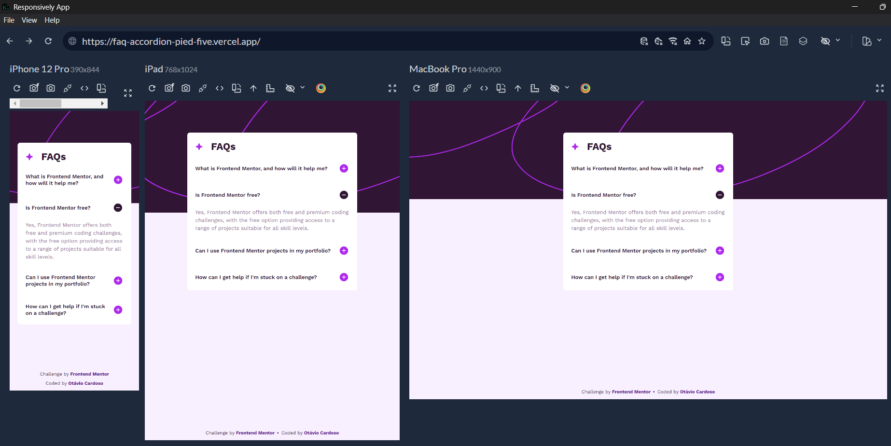

# Frontend Mentor - FAQ accordion solution

This is a solution to the [FAQ accordion challenge on Frontend Mentor](https://www.frontendmentor.io/challenges/faq-accordion-wyfFdeBwBz). Frontend Mentor challenges help you improve your coding skills by building realistic projects. 

## Table of contents

- [Overview](#overview)
  - [The challenge](#the-challenge)
  - [Screenshot](#screenshot)
  - [Links](#links)
- [My process](#my-process)
  - [Built with](#built-with)
  - [What I learned](#what-i-learned)
  - [Continued development](#continued-development)
- [Author](#author)

## Overview

### The challenge

Users should be able to:

- Hide/Show the answer to a question when the question is clicked
- Navigate the questions and hide/show answers using keyboard navigation alone
- View the optimal layout for the interface depending on their device's screen size
- See hover and focus states for all interactive elements on the page

### Screenshot



### Links

- Solution URL: [Repo](https://github.com/otaviozerotwo/FAQ-accordion)
- Live Site URL: [Deploy](https://faq-accordion-pied-five.vercel.app/)

## My process

### Built with

- Semantic HTML5 markup
- Tailwind CSS
- Flexbox
- CSS Grid
- Mobile-first workflow
- [React (com Vite)](https://reactjs.org/) - JS library
- Accessibility (a11y)

### What I learned

- Smooth Accordion Transition with CSS Grid:

  ```js
  <div
    className={`grid transition-all duration-300 ease-in-out ${isOpen ? 'grid-rows-[1fr] opacity-100' : 'grid-rows-[0fr] opacity-0'}`}
  >
    <div id={`faq-content-${id}`} className='overflow-hidden'>
      <p className='pb-4 text-purple-600'>{content}</p>
    </div>
  </div>
  ```

- Accessibility & ARIA Attributes:

  ```js
  <button
    onClick={onToggle}
    className='w-full py-6 flex justify-between items-center gap-4 cursor-pointer'
    aria-controls={`faq-content-${id}`}
    aria-expanded={isOpen ? 'true' : 'false'}
  >
  ```

- React State & List Rendering:

  ```js
  const handleToggle = (index) => {
    setOpenIndex(openIndex === index ? null : index);
  };

  return (
    <div>
      <ul>
        {items.map((item, index) => (
          <li key={index}>
            <AccordionItem
              id={item.id}
              title={item.title}
              content={item.content}
              isOpen={openIndex === index}
              onToggle={() => handleToggle(index)}
            />
          </li>
        ))}
      </ul>
    </div>
  );
  ```

### Continued development

- Web Accessibility (WAI-ARIA): Practice advanced keyboard navigation (such as using arrow keys to navigate between tabs/accordions, in accordance with W3C guidelines).
- React state management & custom hooks: Continue exploring how to manage more complex states as components grow..
- Micro-animations and transitions: Explore other animation techniques and transitions in interactive components..

## Author

- GitHub - [@otaviozerotwo](https://github.com/otaviozerotwo)
- Frontend Mentor - [@otaviozerotwo](https://www.frontendmentor.io/profile/otaviozerotwo)